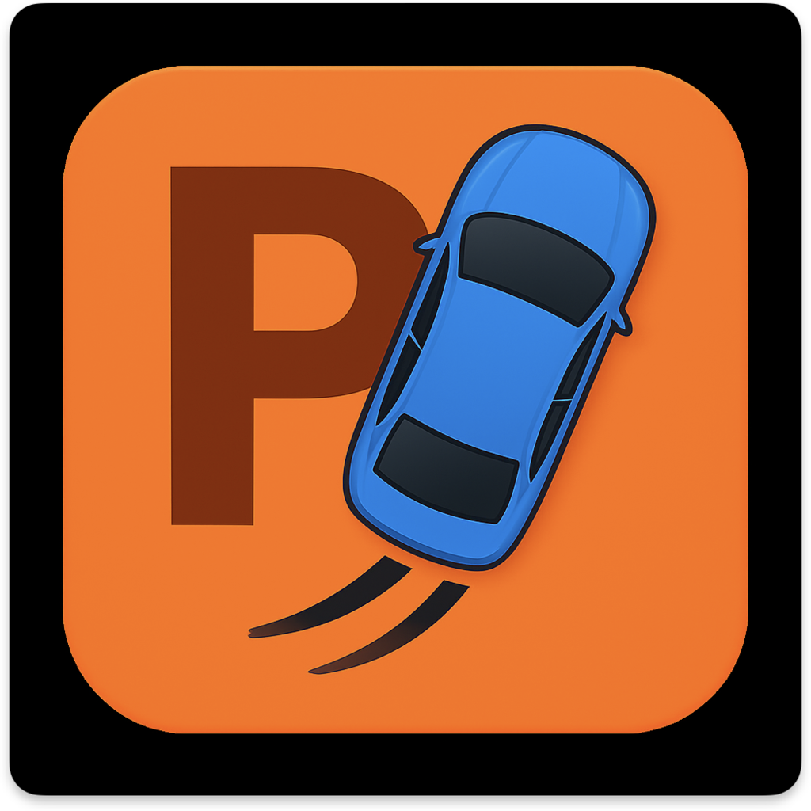

<p align="center">
  
</p>

# Park

**Street parking sign decoder.** Point your camera at any parking sign — however many plates are stacked on one pole — and get a single plain-English verdict: *"You can park here until 6 pm today. Free."*

## How it works

```
Live camera (VisionKit DataScanner)
        │  continuous on-device OCR — no shutter, no capture step
        ▼
Context engine
        │  current time/day · EventKit holidays · CoreLocation city
        │  (manual picker for 10 cities) · permit-zone notes
        ▼
Gemini 2.5 Flash
        │  schema-enforced JSON: status + summary + rule breakdown
        ▼
Verdict card
        🟢 park safely  ·  🟡 conditions apply  ·  🔴 do not park
```

Every scan is saved locally (SwiftData) with its GPS coordinate and a photo of the sign, and appears on a MapKit map — pins are colour-coded by verdict, and scans older than 30 days turn grey to signal the rules may have changed.

## Features

- **Live sign reader** — VisionKit `DataScannerViewController` recognizes text continuously with on-screen highlighting; one tap decodes
- **Context-aware verdicts** — holiday detection (subscribed calendars + built-in US federal fallback), city detection with manual override (NYC, Jersey City, LA, SF, Toronto, Vancouver, Boston, Chicago, Miami, San Diego)
- **Scan history & map** — last 10 scans on the home screen; recency-aware map pins with full verdict detail sheets
- **Privacy by design** — sign photos and OCR text never leave the device. The `SharedScanPayload` type codifies the only fields a future community feature may share: verdict, coordinate, timestamp

## Tech stack

| Layer | Technology |
|---|---|
| Live OCR | VisionKit DataScanner (on-device) |
| AI interpretation | Gemini API (`gemini-2.5-flash`, structured output) |
| Location | CoreLocation + reverse geocoding |
| Holidays | EventKit + federal-holiday fallback |
| Persistence | SwiftData (photos in external storage, local-only) |
| Map | MapKit |
| UI | SwiftUI (iOS 17+, `@Observable`) |

## Setup

1. Clone the repo and open `Park.xcodeproj`
2. Get a free Gemini API key from [Google AI Studio](https://aistudio.google.com)
3. Create `Park/Secrets.plist`:
   ```xml
   <?xml version="1.0" encoding="UTF-8"?>
   <!DOCTYPE plist PUBLIC "-//Apple//DTD PLIST 1.0//EN" "http://www.apple.com/DTDs/PropertyList-1.0.dtd">
   <plist version="1.0">
   <dict>
       <key>GEMINI_API_KEY</key>
       <string>YOUR_KEY_HERE</string>
   </dict>
   </plist>
   ```
   (`Secrets.plist` and `.env` are gitignored — keys never get committed.)
4. Run on a **real device** — the live scanner requires a camera and an A12 chip or newer (iPhone XS+). The simulator won't work.

## Roadmap

- **Phase 4 — platform features** (placeholders in codebase): WidgetKit home screen widget, ActivityKit Live Activity parking timer, Siri "scan this parking sign" App Intent
- **v2 — community map**: anonymous scan contributions (verdict + coordinate + timestamp only) building a sign-level map with recency confidence indicators — pins weighted by scan count and age

## Project structure

```
Park/
├── ParkApp.swift            App entry, SwiftData container
├── ContentView.swift        Home: animated intro, recent scans, scan button
├── CameraView.swift         Live scanner UI + city picker + decode button
├── ScannerViewModel.swift   OCR text → context → Gemini → saved record
├── GeminiClient.swift       Structured-output API client
├── ParkingVerdict.swift     Verdict model (safe / caution / danger)
├── ScanContext.swift        Time, holiday, city + permit-zone library
├── LocationManager.swift    CoreLocation city + coordinates
├── HolidayDetector.swift    EventKit + US federal holiday rules
├── ScanRecord.swift         SwiftData model + SharedScanPayload contract
├── MapView.swift            Recency-coded pins + detail sheets
├── ResultView.swift         Verdict card + rule breakdown
└── Park{Widget,LiveActivity,Intents}.swift   Phase 4 placeholders
```
